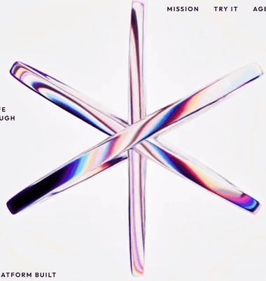
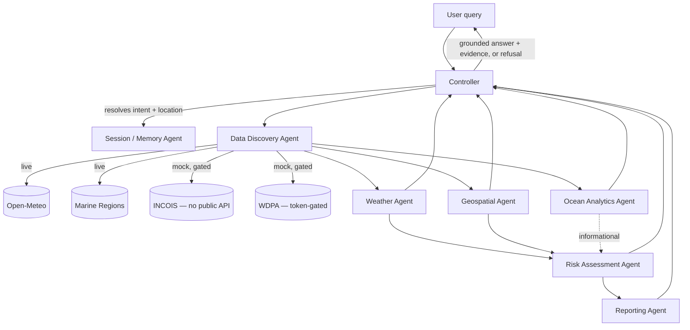

# 🐋 ORCA Marine

**Agentic AI platform for marine ecosystem reasoning** — built for SIH26176 (ISRO problem statement).

<p align="center">
  
</p>

<p align="center">
  
  
  
  
  
  
</p>

---

## What this is

Eight cooperating agents reason over live weather, ocean analytics, and maritime geospatial data to answer questions a fisherman might act on — *"Is it safe to fish off Chennai today?"* — and **every answer carries evidence**, or the system refuses to answer.

> **The one rule the whole system is built around:** every agent response must carry a source and a timestamp. The Controller refuses to answer if no agent can ground the query. This is a safety-critical domain — no ungrounded output, ever.

## Table of contents

- [Architecture](#architecture)
- [The 8 agents](#the-8-agents)
- [Live vs. mock data](#live-vs-mock-data)
- [Quick start](#quick-start)
- [Try it](#try-it)
- [Project structure](#project-structure)
- [Testing](#testing)
- [Known limitations](#known-limitations)

## Architecture



Every specialist agent is a thin reasoning layer on top of **one** data-fetching layer (`DataDiscoveryAgent`) — it's the only place that touches `httpx` or the mock JSON files, so live/mock fallback logic lives in exactly one place instead of being duplicated three times.

## The 8 agents

| Agent | Role | Data |
|---|---|---|
| **Controller** | Routes every query, resolves intent (LLM-first, keyword-rule fallback), refuses to answer if nothing can be grounded | — |
| **Weather** | Wind, wave height, marine conditions | 🟢 Live — Open-Meteo |
| **Ocean Analytics** | PFZ / chlorophyll / SST | 🟡 Mock — no public INCOIS API |
| **Geospatial** | Maritime boundary (EEZ) + MPA geofencing | 🟢 EEZ live (Marine Regions) · 🟡 MPA mock (3 curated Indian MPAs) |
| **Data Discovery** | The one fetch layer every other agent depends on | live + mock, unified |
| **Memory / Session** | Multi-turn context — resolves follow-ups like *"what about the wind?"* | in-memory |
| **Reporting** | Renders a self-contained Leaflet map + evidence HTML report per grounded answer | — |
| **Risk Assessment** | Deterministic 0–6 hazard score from weather + MPA proximity + ocean analytics | computed, not ML |

## Live vs. mock data

| Dataset | Status | Source |
|---|---|---|
| Weather | 🟢 **Live**, falls back to mock | [Open-Meteo](https://open-meteo.com) — free, no key |
| Maritime boundary (EEZ) | 🟢 **Live**, no fallback (never guess a boundary) | [Marine Regions](https://marineregions.org) — free, no key |
| Ocean analytics (PFZ) | 🟡 **Mock only** | INCOIS has no public REST API — per-district PDF bulletins only |
| MPA proximity | 🟡 **Mock only** | WDPA/Protected Planet API needs a registration-gated token |

Every mocked response says so explicitly, inline, in the answer itself — never silently.

## Quick start

```bash
# Backend
pip install -r requirements.txt
uvicorn app.main:app --reload

# Frontend (separate terminal)
cd frontend
npm install
npm run dev
```

Backend runs on `http://localhost:8000`, frontend on `http://localhost:5173` — the frontend's **Ask ORCA** section calls the backend directly.

Optional — enable the LLM intent path:

```bash
export OPENAI_API_KEY=sk-...
```

Without it, the system runs entirely on free, keyless paths (Open-Meteo + Marine Regions + keyword-rule intent detection) — this is the default and costs nothing.

## Try it

```bash
curl -X POST http://localhost:8000/query \
  -H "Content-Type: application/json" \
  -d '{"query": "Is it safe to fish off Chennai today?"}'
```

Or open the frontend and use the **Ask ORCA** demo section — it renders the grounded/refused badge, intent, full evidence list, and a link to the generated map report.

## Project structure

```
app/
  agents/              # 8 agents — each a thin reasoning layer over DataDiscoveryAgent
  controller.py         # intent routing, session context, the grounding rule
  data_discovery_agent  # the one place that calls httpx / reads mock JSON
  locations.py          # shared location coordinates + EEZ resolution
  session_store.py      # multi-turn context (in-memory)
  main.py                # FastAPI app, CORS, /reports static mount
frontend/
  src/components/       # Nav, Hero, Mission, Demo, Agents, Platform, Team
  public/assets/video/  # hero video (3D chrome-ring, re-encoded for reliable looping)
tests/                  # 28 tests, dependency-injection style
reports/                 # generated per-query HTML reports (Leaflet map + evidence)
```

## Testing

```bash
pytest -v
```

28/28 passing — full suite re-run after every change, not just once at the end.

## Known limitations

- **Ocean Analytics** and **MPA proximity** run on mock data — real INCOIS/WDPA integration is blocked on API access, not effort. Tracked as a follow-up.
- The LLM intent classifier sees only the current message, not conversation history, so it can still say `unknown` on a bare follow-up (session memory then fills the gap from the *previous* turn's resolved intent/location).
- SIH team roster is still solo — the 6-member / 1-woman / SPOC rule isn't satisfied yet.

---

<p align="center"><sub>Built for SIH 2026 · ISRO problem statement 26176</sub></p>
